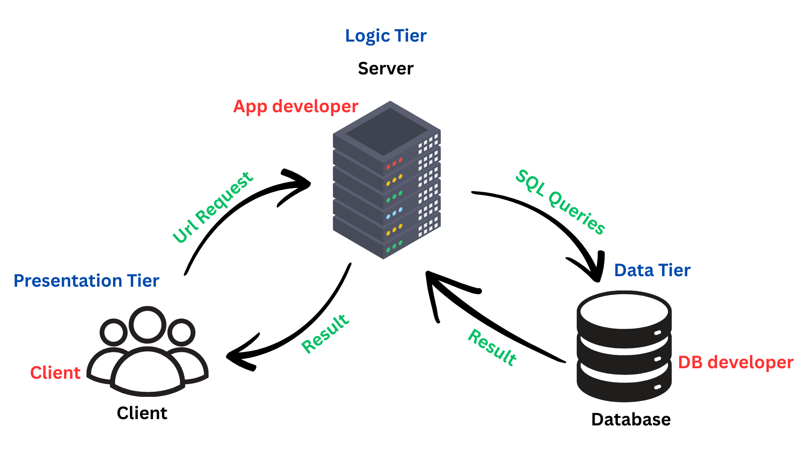

# Advanced Curiosity Tasks (Style: "How Do Big Systems...") 
-----------------------------

## Task 1: "How Do Big Systems Store Data?"
-  Do apps like Instagram, Uber, or Amazon use SQL databases or something
else?

	- Instagram -> uses PostgreSQL for relational data and Cassandra for large-scale data storage.
	- Uber -> uses MySQL for transactional data and Apache Cassandra for large-scale data storage.
	- Amazon -> uses a combination of Amazon RDS (Relational Database Service) for SQL databases and DynamoDB for NoSQL data storage.

- kind of database structure big companies use and why.

| Type              | Company   | Why                                   | 
|-------------------|-----------|---------------------------------------|
| Relational        | Instagram | Structured data, complex queries      |
| Non Relational    | Instagram | Large-scale data storage, flexibility |
| Relational        | Uber      | Transactional data, complex queries   |
| Non Relational    | Uber      | Scalability, flexibility              |
| Relational        | Amazon    | Transactional data, complex queries   |
| Non Relational    | Amazon    | Scalability, high availability        |

-  SQL Server useage in big companies.
	- SQL Server is used by companies like Microsoft, Dell, and Bank of America for its robust features, scalability, and integration with other Microsoft products.

- What Kinde of database dose instagram use?
	- Instagram uses a combination of PostgreSQL for relational data and Cassandra for large-scale data storage.

-------

## Task 2: "Do Video Games Use Databases?"

Yes, video games use databases to store player data, game state, and other information. They often use NoSQL databases like MongoDB or Redis for real-time data storage and retrieval.

- How do online games (like PUBG, Fortnite, etc.) store player progress, points, and
profiles?

	- Online games like PUBG and Fortnite use databases to store player progress, points, and profiles. They often use a combination of SQL and NoSQL databases for this purpose. For example, they might use MySQL for structured data like player profiles and MongoDB for unstructured data like game logs and events.

- Do Video Games use SQL databases or something else?
	- Yes, video games use SQL databases for structured data storage, but they also use NoSQL databases for unstructured data and real-time data processing. For example, many games use Redis for caching and real-time data storage, while using SQL databases like MySQL or PostgreSQL for player profiles and game state.
	
- Example of a game that uses a relational database.
	- Call of Duty Warzone uses a relational database to store player data, game state, and other structured information. It uses MySQL for this purpose.
	- Minecraft uses a relational database to store player data, game state, and other structured information. It uses MySQL for this purpose.

------------
## Task 3: "Can a Database Work Without the Internet?"
Yes, a database can work without the internet. Local databases like SQLite or Microsoft Access can be used to store data on a local machine without requiring an internet connection.

- How databases are used in offline systems, like in military bases or
airplanes.

	- Military bases use databases to store personnel records, equipment inventories, and mission data. 
	- Airplanes use databases to store flight data, maintenance records, and passenger information. 

These databases are designed to work without an internet connection and can sync with central databases when a connection is available.

- kind of database do they use when no internet is available?
	-  SQLite -> a lightweight, serverless database that can be used for local storage.
	
- Can SQL Server be used offline?
	- Yes, SQL Server can be used offline. SQL Server Express is a lightweight version of SQL Server that can be installed on a local machine and used without an internet connection. It allows for local data storage and processing.

-------------------
## Task 4: "What Makes Online Stores So Fast?"
Online stores like Amazon and eBay use a combination of caching, load balancing, and distributed databases to handle millions of transactions per second. They use caching to store frequently accessed data in memory, reducing the need for database queries. Load balancing distributes incoming requests across multiple servers to ensure that no single server is overwhelmed. Distributed databases allow for horizontal scaling, enabling the system to handle large amounts of data and traffic.

- How do e-commerce platforms (like Amazon or Noon) organize their product and
order data for fast searching?
	- E-commerce platforms like Amazon and Noon use a combination of indexing, caching, and distributed databases to organize their product and order data for fast searching. They create indexes on frequently searched fields, cache popular products in memory, and use distributed databases to handle large amounts of data efficiently.

- Do they use relational databases, cloud, or both?
	- E-commerce platforms typically use a combination of both relational databases and cloud services. They may use relational databases like MySQL or PostgreSQL for structured data and cloud services like Amazon DynamoDB or Google Cloud Firestore for scalability and flexibility.

- What challenges do they face in storing millions of products?
	- Challenges include data consistency, scalability, and performance. They need to ensure that data is consistent across multiple servers, can scale to handle millions of products, and can perform efficiently under heavy load. Additionally, they need to manage complex queries and transactions while maintaining fast response times.

----------------------------------
## Task 5: "How Do Banks Protect Their Data?"
Banks use a combination of encryption, access controls, and auditing to protect their data. They encrypt sensitive data both at rest and in transit to prevent unauthorized access. Access controls ensure that only authorized personnel can access sensitive data. Auditing tracks changes to data and user access, allowing banks to monitor for suspicious activity.

- How banking systems use databases to protect sensitive customer data.
	- Banking systems use databases to store sensitive customer data, such as account information and transaction history. They implement encryption, access controls, and auditing to protect this data. For example, they may use AES encryption to encrypt data at rest and TLS to encrypt data in transit. Access controls ensure that only authorized personnel can access sensitive data, while auditing tracks changes to data and user access.

- What database features help with security and integrity?

	- Encryption: Encrypts data at rest and in transit to protect it from unauthorized access.
	- Access controls: Restricts access to sensitive data based on user roles and permissions.
	- Auditing: Tracks changes to data and user access, allowing for monitoring and compliance.
	- Backup and recovery: Ensures that data can be restored in case of loss or corruption.
	- Data masking: Hides sensitive data in non-production environments to protect it from unauthorized access.

- Find one bank or financial system that uses Oracle or SQL Server.
	- Bank of America uses Oracle .
	- Wells Fargo uses SQL Server .
	- JPMorgan Chase uses Oracle .
	- Citibank uses SQL Server .

--------------------------------------------------------------
## Task 6: "Draw Me the System!"
)