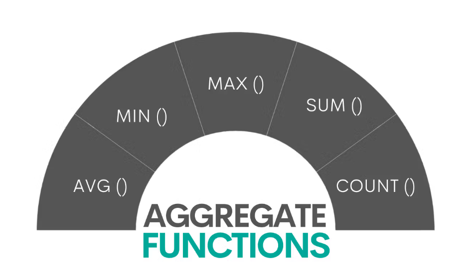

# Aggregate Function

**Definition**: An aggregate function is a mathematical operation that combines multiple values to produce a single value. It is commonly used in data analysis and database queries to summarize or analyze large datasets.

**Purpose**: Aggregate functions are used to perform calculations on a set of values, returning a single value that represents the result of the operation. They are often used in conjunction with the `GROUP BY` clause in SQL to group rows that have the same values in specified columns.



**Common Aggregate Functions**:
1. **COUNT()**: Returns the number of rows that match a specified condition.
   - Example: `SELECT COUNT(*) FROM employees;`

2. **SUM()**: Returns the total sum of a numeric column	.
	- Example: `SELECT SUM(salary) FROM employees;`

3. **AVG()**: Returns the average value of a numeric column.
   - Example: `SELECT AVG(salary) FROM employees;`

4. **MIN()**: Returns the minimum value in a set of values.
   - Example: `SELECT MIN(salary) FROM employees;`

5. **MAX()**: Returns the maximum value in a set of values.
   - Example: `SELECT MAX(salary) FROM employees;`

## What is `GROUP BY`?

**Definition**: The `GROUP BY` clause in SQL is used to arrange identical data into groups. It is often used with aggregate functions to perform calculations on each group of data.

**Purpose**: The `GROUP BY` clause is used to group rows that have the same values in specified columns, allowing aggregate functions to be applied to each group. This is useful for summarizing data and generating reports.

**Example**: 
```sql
SELECT department, COUNT(*) AS employee_count
FROM employees
GROUP BY department;
```

This query counts the number of employees in each department by grouping the results based on the `department` column and applying the `COUNT()` aggregate function to each group.

## What is `HAVING`?

**Definition**: The `HAVING` clause in SQL is used to filter records after the `GROUP BY` operation has been performed. It allows you to specify conditions on aggregate functions.

**Purpose**: The `HAVING` clause is used to filter groups based on aggregate values, allowing you to restrict the results of a query that uses `GROUP BY`. It is similar to the `WHERE` clause but operates on aggregated data.

**Example**: 
```sql
SELECT department, AVG(salary) AS average_salary
FROM employees
GROUP BY department
HAVING AVG(salary) > 50000;
```

This query calculates the average salary for each department and filters the results to include only those departments where the average salary is greater than 50,000. The `HAVING` clause is applied after the `GROUP BY` operation, allowing for conditions on aggregated data.

