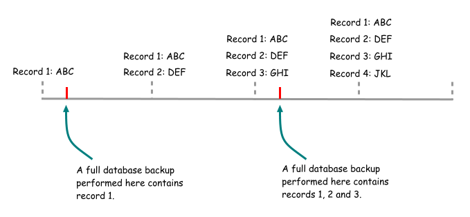
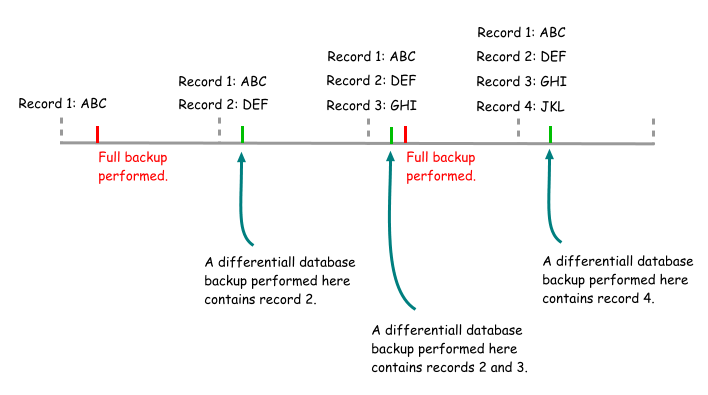
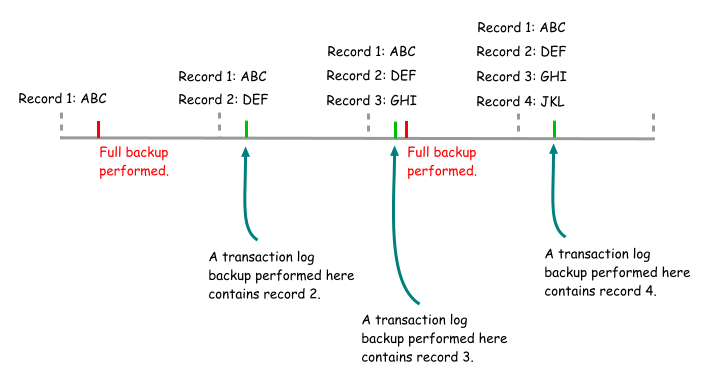

# Backup in SQL

## What is a Backup?

A backup in SQL is a copy of the database or specific database objects that can be used to restore the data in case of data loss, corruption, or other issues. Backups are essential for data protection and disaster recovery.

## Why Use a Backup?

Backups are used to:
- **Protect against data loss**: They ensure that you can recover your data in case of accidental deletion, hardware failure, or other disasters.

- **Facilitate data recovery**: Backups allow you to restore your database to a previous state, which is crucial for maintaining data integrity.

- **Support testing and development**: Backups can be used to create test environments without affecting the production data.

## Types of Backups

### 1. Full Backup

A full backup is a complete copy of the entire database. It includes all data, schema, and objects. Full backups are typically performed at regular intervals (e.g., daily or weekly) to ensure that you have a recent copy of the entire database.

- **.MDF + .LDF** files are the main files of the database.
- **Full backups take more time**

**Syntax to create a full backup:**
```sql
BACKUP DATABASE database_name
TO DISK = 'path_to_backup_file.bak';
```




### 2. Differential Backup
A differential backup captures only the data that has changed since the last full backup. This type of backup is smaller and faster than a full backup, making it useful for frequent backups.

- **.MDF + .LDF** files are the main files of the database, and differential backups only include changes made since the last full backup.
- **Its start from the last full backup** and only includes changes made since then.

**Syntax to create a differential backup:**
```sql
BACKUP DATABASE database_name
TO DISK = 'path_to_backup_file.bak'
WITH DIFFERENTIAL;
```


### 3. Transaction Log Backup

A transaction log backup captures all the transactions that have occurred since the last transaction log backup. This type of backup is essential for point-in-time recovery, allowing you to restore the database to a specific moment.

- **log file (.LDF)** is used to store transaction logs, which record all changes made to the database.
- **Its start from the last transaction log backup** and includes all transactions that have occurred since then.

**Syntax to create a transaction log backup:**
```sql
BACKUP LOG database_name
TO DISK = 'path_to_log_backup_file.trn';
```


