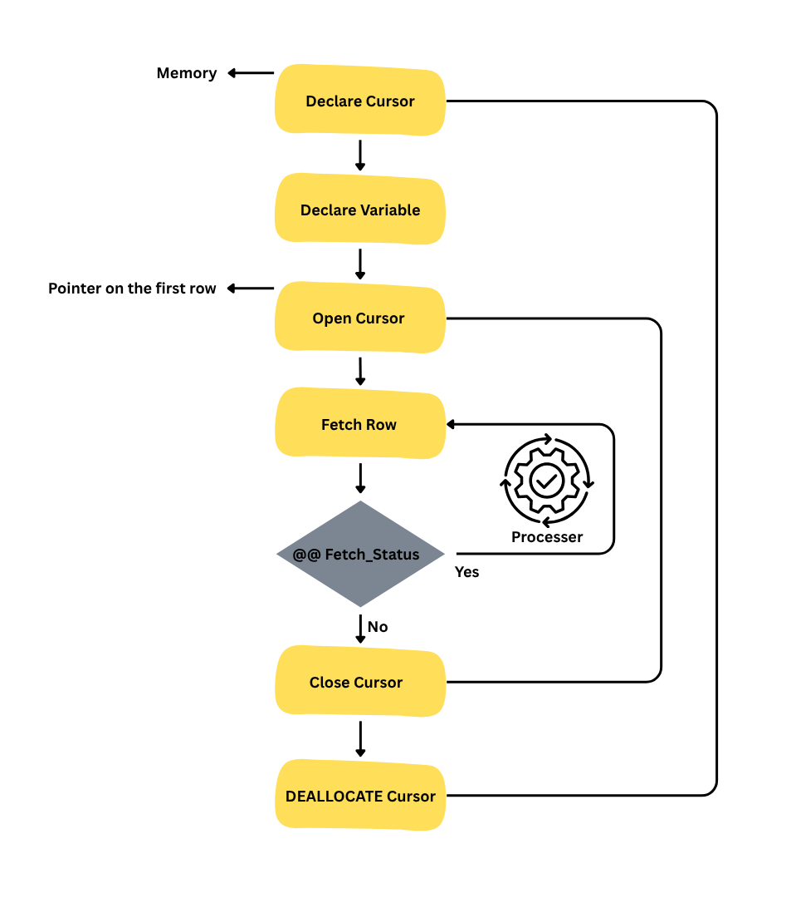

# Cursor in SQL

## # What is a Cursor?
A cursor in SQL is a database object that allows you to retrieve and manipulate rows returned by a query one at a time. 
Cursors are particularly useful when you need to process individual rows returned by a query, especially in procedural programming contexts.

## # Why Use a Cursor?

Cursors are used to:
- **Iterate through query results**: They allow you to fetch rows one at a time, which is useful for row-by-row processing.

- **Perform complex operations**: Cursors can be used to perform operations that require multiple steps or conditions on each row.
- **Maintain state**: Cursors can maintain the current position in a result set, allowing you to navigate through the data.

**Syntax to declare an cursor:**
```sql

DECLARE cursor_name CURSOR FOR
SELECT column1, column2 FROM table_name WHERE condition;
```

**Syntax to open, fetch, and close an cursor:**
```sql

OPEN cursor_name;
FETCH NEXT FROM cursor_name INTO variable1, variable2;
WHILE @@FETCH_STATUS = 0
BEGIN
	-- Process the fetched row
	FETCH NEXT FROM cursor_name INTO variable1, variable2;
END
CLOSE cursor_name;
DEALLOCATE cursor_name;
```



