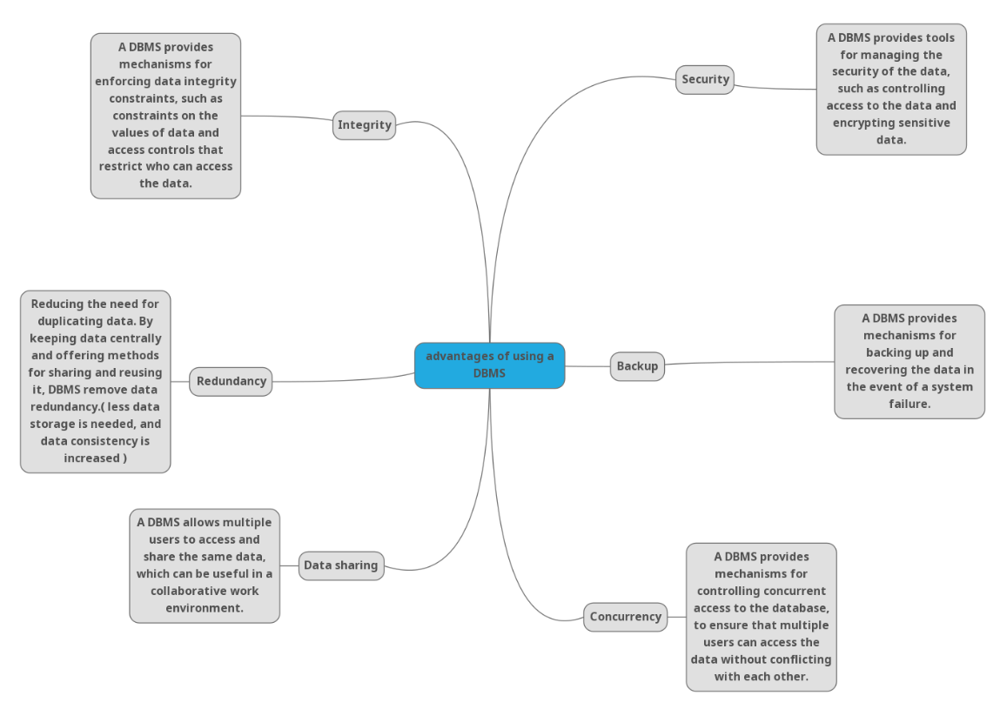

# Task 1 ( Report )
## Database Search and Reporting Task
--------------------------------------

### *1. Flat File Systems Vs Relational Databases*

|                    | Flat File Systems                              | Relational Databases                                |
|--------------------|------------------------------------------------|-----------------------------------------------------|
| Data Structure     | Simple file that stores data in a single table | Structured data stored in multiple related tables   |
| Data Redundancy    | High redundancy, as data is often duplicated   | Low redundancy, as data is normalized across tables |
| Relationships      | No relationships between data                  | Relationships established through foreign keys      |
| Example Usage      | Small datasets, simple applications            | Large datasets, complex applications                |
| Drawbacks          | Limited querying, data integrity issues        | More complex setup, requires knowledge of SQL       |

---------------------------------------------------------

### *2. Advantages of using a DBMS*

- Data Integrity: Ensures accuracy and consistency of data.
- Data Security: Protects data from unauthorized access.
- Data Backup: Regular backups to prevent data loss.
- Data Redundancy: Minimizes data duplication.
- Concurrency Control: Manages simultaneous data access.
- Data Sharing: Facilitates data sharing among users.

----------------------------------------------------------------

### *3. Roles in a Database System*

#### - System Analyst :
A person who analyzes and designs information systems to meet business needs.
#### Role:
- Gathers requirements from stakeholders.
- Analyzes system requirements and designs the database structure.
- Works with developers to ensure the system meets user needs.

#### - Database Designer :
A person who designs the database schema and structure.
#### Role:
- Creates the database schema, including tables, relationships, and constraints.
- Ensures data integrity and normalization.
- Works with developers to implement the database design.
	

#### - Database Developer :
A person who develops and maintains the database.
#### Role:
- Writes SQL queries and scripts to create and modify database objects.
- Optimizes database performance and security.
- Works with application developers to integrate the database with applications.

#### - Database Administrator (DBA) :
A person responsible for managing and maintaining the database.
#### Role:
- Monitors database performance and security.
- Performs backups and recovery operations.
- Manages user access and permissions.
	
#### - Application Developer :
A person who develops applications that interact with the database.
#### Role:
- Writes code to interact with the database using SQL.
- Designs user interfaces and application logic.
- Works with the DBA to ensure the application meets performance and security requirements.
	
#### - BI Developer :
A person who develops business intelligence solutions using the database.
#### Role:
- Designs and develops reports, dashboards, and data visualizations.
- Analyzes data to provide insights and support decision-making.
- Works with the DBA to ensure data is accurate and accessible for reporting. 

-----------------------------------------------------------------

## Additional Research Topics

### 1. Types of Databases

| Type           | Description                                                    | Examples                  | Use Cases                     |
|----------------|----------------------------------------------------------------|---------------------------|-------------------------------|
|Relational      | Structured data stored in tables with relationships            | MySQL, PostgreSQL, Oracle | Transactional systems         |
|Non -Relational | Unstructured data stored in various formats                    | MongoDB, Cassandra, Redis | Big data, real-time analytics |

------------------------------------------
### 2. Centralized vs Distributed vs Cloud Databases
| Type        | Description                                                    | Examples                        | Use Cases                        |
|-------------|----------------------------------------------------------------|---------------------------------|----------------------------------|
| Centralized | Single database stored in one location                         | Oracle, SQL Server              | Small to medium-sized businesses |
| Distributed | Multiple databases stored in different locations               | Google Spanner, Amazon DynamoDB | Large-scale applications         |
| Cloud       | Databases hosted on cloud platforms                            | Amazon RDS, Azure SQL           | Scalable applications            |

------------------------------------------

### 3. Cloud Storage and Databases
Meaning: -> it refers to the storage of data on remote servers accessed via the internet, rather than on local servers or personal computers.
How dose it relate to databases: -> Cloud storage is often used to store database backups, and cloud databases are hosted on cloud platforms, allowing for scalability and flexibility.

### Advantages and Disadvantages of using cloud-based databases
- Advantages:
  - Scalability: Easily scale resources up or down based on demand.
  - Cost-Effective: Pay only for what you use, reducing infrastructure costs.
  - Accessibility: Access data from anywhere with an internet connection.
  - Automatic Backups: Regular backups and disaster recovery options.
- Disadvantages:
  - Security Concerns: Data may be vulnerable to breaches.
  - Downtime: Dependence on internet connectivity and service provider uptime.
  - Compliance Issues: May not meet regulatory requirements for data storage.
  - Limited Control: Less control over hardware and software configurations.

  -----------------------
### Database Engines and Languages

• What is a Database Engine?

- A database engine is the underlying software that manages and interacts with the database, handling data storage, retrieval, and processing.

• What languages do they use? (e.g., T-SQL, PL/SQL, ANSI SQL)

- T-SQL: Used in Microsoft SQL Server for procedural programming and querying.
- PL/SQL: Used in Oracle databases for procedural programming and querying.
- ANSI SQL: A standard language for querying and manipulating relational databases.

• Is there a relationship between the engine and the language?

- Yes, different database engines may have their own specific languages or dialects based on ANSI SQL, which are optimized for their respective systems. For example, T-SQL is specific to Microsoft SQL Server, while PL/SQL is specific to Oracle databases.

• Can one language work across different engines?

- Some languages, like ANSI SQL, can work across different engines, but specific features and functions may vary between engines. Therefore, code written in one engine's dialect may not work in another without modification.

-----------------

### - Can We Transfer a Database Between Engines?

- Yes, it is possible to transfer a database between different engines, but it may require data migration tools or scripts to convert the data and schema to the target engine's format. Additionally, some features or functions may not be compatible, requiring adjustments to the code.

#### - Is it possible to migrate a database from SQL Server to MySQL, or Oracle to PostgreSQL?

- Yes, it is possible to migrate a database from SQL Server to MySQL or Oracle to PostgreSQL. However, the migration process may involve data transformation, schema conversion, and testing to ensure compatibility and functionality in the target engine.

#### - What are the challenges of engine-to-engine migration?

- Data Type Compatibility: Different engines may have different data types, requiring conversion.
- Schema Differences: The structure of tables, indexes, and relationships may vary.
- Stored Procedures and Functions: Different engines may have different syntax and features for stored procedures and functions.
- Performance Optimization: Queries and indexes may need to be optimized for the target engine.
- Testing: Extensive testing is required to ensure data integrity and application functionality after migration.
- Downtime: Migration may require downtime, affecting application availability.
- Triggers: Different engines may have different support and syntax for triggers.

#### - What should we consider before transferring (data types, triggers, stored procedures, etc.)?

- Data Types: Ensure compatibility of data types between engines.
- Schema Structure: Review and adjust the schema for the target engine.
- Triggers: Check if triggers are supported and compatible in the target engine.
- Stored Procedures: Rewrite or convert stored procedures to the target engine's syntax.
- Indexes: Review and optimize indexes for performance in the target engine.
- Testing: Plan for thorough testing of the migrated database to ensure functionality and performance.
- Backup: Always take a backup of the original database before migration.
- Downtime: Consider the impact of downtime during migration and plan accordingly.
- Data Integrity: Ensure data integrity during the migration process.
- Documentation: Document the migration process and any changes made for future reference.

-----------------
### Logical vs. Physical Schema

#### - What is the Logical Schema in database design?

- The logical schema is a high-level representation of the database structure, focusing on the organization of data and relationships between entities without considering how the data is physically stored.

#### - What is the Physical Schema?

- The physical schema is a low-level representation of the database structure, detailing how data is stored on disk, including data types, indexes, and storage allocation.

#### - What’s the difference between them?

- The logical schema defines the abstract structure of the database, while the physical schema defines the actual implementation details of how data is stored and accessed.

#### - Why is it important to understand both?

- Understanding both schemas is important for database design and optimization. The logical schema helps in conceptualizing the data model and relationships, while the physical schema is crucial for performance tuning, storage management, and ensuring efficient data retrieval.

#### - Example: Show how one entity (e.g., Student) would appear in both logical and physical schemas.

- Logical Schema:
  - Entity: Student
  - Attributes: StudentID (Primary Key), FirstName, LastName, DateOfBirth, Email
  - Relationships: Enrolled in Courses (Many-to-Many relationship with Course entity)

- Physical Schema:
  - Table: Student
  - Columns: 
	- StudentID (INT, PRIMARY KEY, AUTO_INCREMENT)
	- FirstName (VARCHAR(50))
	- LastName (VARCHAR(50))
	- DateOfBirth (DATE)
	- Email (VARCHAR(100))
  - Indexes: 
	- Index on Email for faster search
  - Storage: 
	- Stored in a specific file format on disk with defined block size and allocation.

	------------------------------------------------
- 