# Entity Relationship Diagram (ERD)

## What is an ERD?

An Entity Relationship Diagram (ERD) is a visual representation of the entities within a system and their relationships. It is used to model the data structure and relationships in a database, helping to design and understand how data is organized.

## Main components of an ERD:

- **Entities:** Represent objects or concepts in the system, such as users, products, or orders. Entities are typically represented as rectangles.

- **Attributes:** Characteristics or properties of entities, such as a user's name or a product's price. Attributes are usually represented as ovals connected to their respective entities.

- **Relationships:** Connections between entities that define how they interact with each other. Relationships are represented as diamonds or lines connecting the entities.

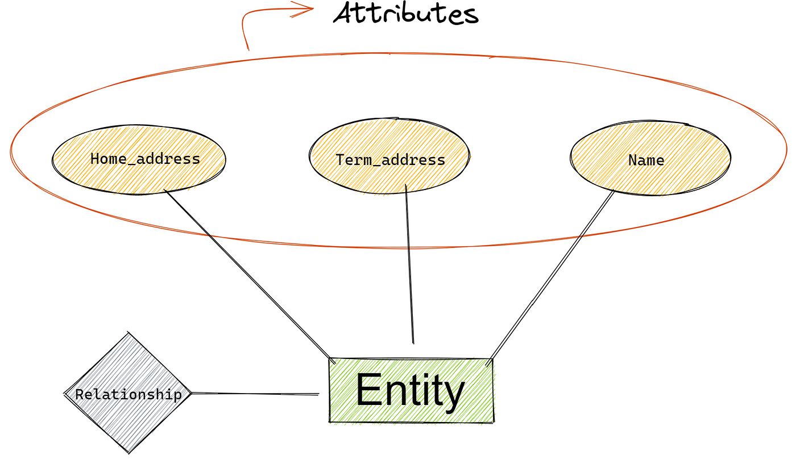

## Type of Entities:
- **Strong Entity:** An entity that can exist independently and has a primary key. It is represented by a rectangle with a single line border.

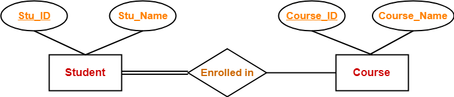

- **Weak Entity:** An entity that cannot exist independently and relies on a strong entity for its existence. It is represented by a rectangle with a double line border.

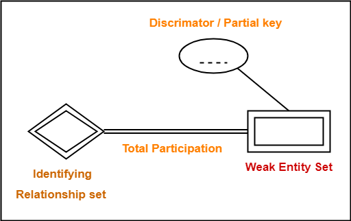

## Type of Attributes:

- **Simple Attribute:** An attribute that cannot be divided further, such as a user's name or age. It is represented by an oval.

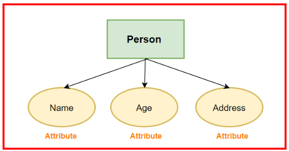

- **Composite Attribute:** An attribute that can be divided into smaller sub-attributes, such as a full address (street, city, state). It is represented by an oval with sub-ovals connected to it.

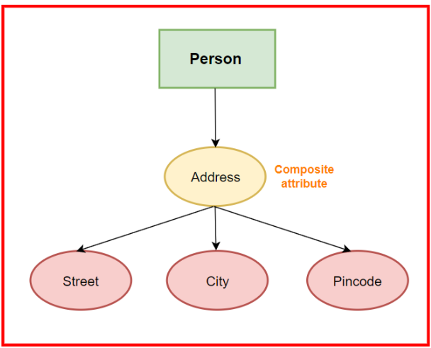

- **Derived Attribute:** An attribute that can be derived from other attributes, such as a user's age calculated from their date of birth. It is represented by a dashed oval.

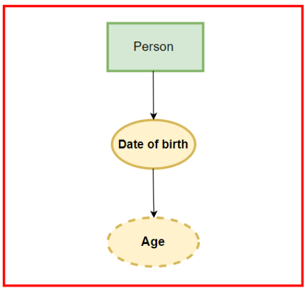

- **Multivalued Attribute:** An attribute that can have multiple values, such as a user's phone numbers. It is represented by a double oval.

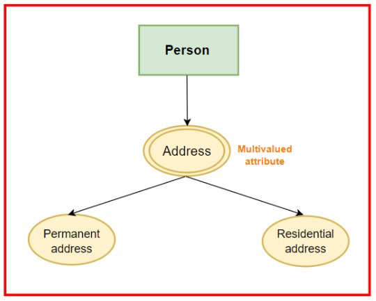

- **Complex Attribute:** An attribute that can contain multiple values and can be further divided into sub-attributes, such as a user's full name (first name, last name). It is represented by an oval with sub-ovals connected to it.

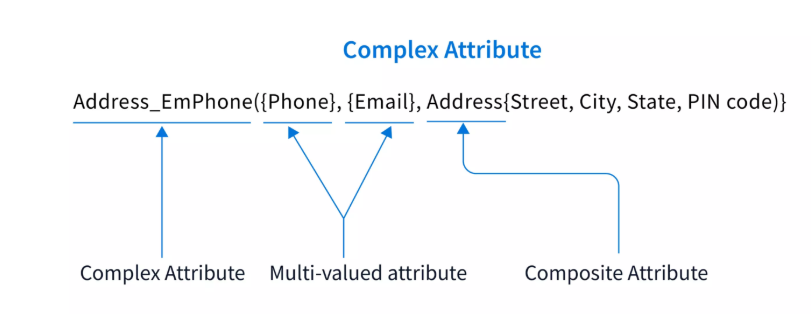

## Type of Relationships:

1. **Degree of Relationship:**
   - **Unary Relationship:** A relationship between instances of the same entity type, such as a person being related to another person (e.g., parent-child relationship).
   - **Binary Relationship:** A relationship between two different entity types, such as a customer placing an order.
   - **Ternary Relationship:** A relationship involving three different entity types, such as a student enrolling in a course with a specific instructor.

	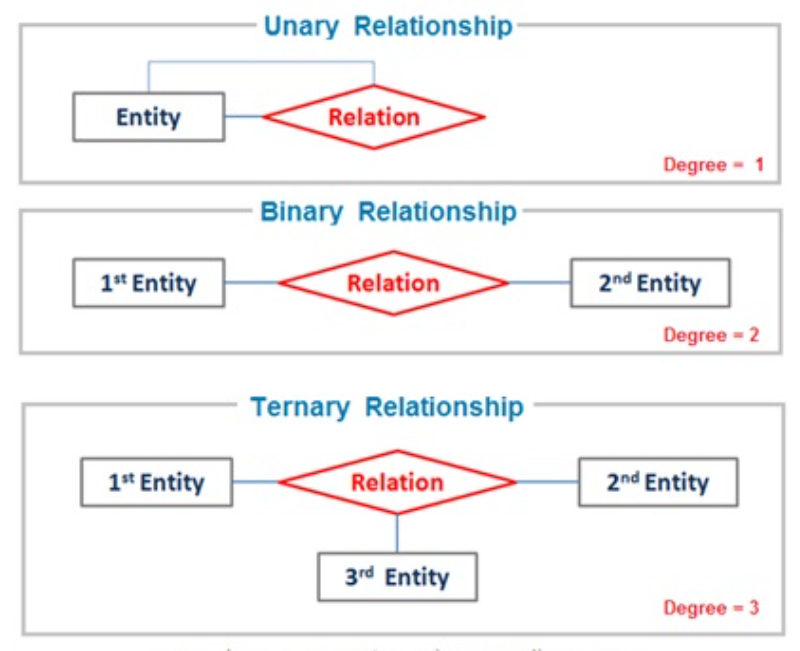

2. **Cardinality of Relationship:**
	- **One-to-One (1:1):** Each instance of one entity is related to exactly one instance of another entity. For example, a person has one passport.
	
	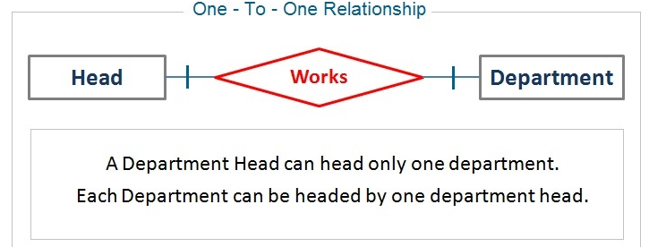 
	 
	- **One-to-Many (1:N):** Each instance of one entity can be related to multiple instances of another entity. For example, a customer can place multiple orders.
	
	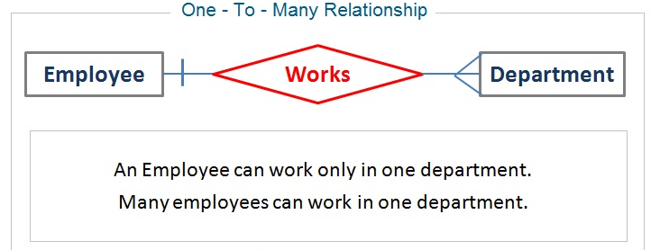 
	
	- **Many-to_Many (M:N):** Each instance of one entity can be related to multiple instances of another entity, and vice versa. For example, students can enroll in multiple courses, and each course can have multiple students.
	
	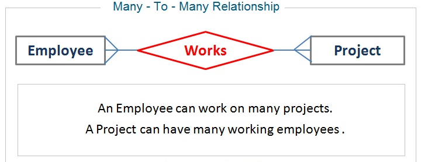 

~~Note:~~
- The Cordinality of a relationship it work with compare row by row, not with the whole table.
- It can have to relationships between two entities, one for each direction of the relationship.

## Participation of Relationship:

- **Total Participation:** All instances of an entity must participate in the relationship. It is represented by a double line connecting the entity to the relationship.

- **Partial Participation:** Some instances of an entity may not participate in the relationship. It is represented by a single line connecting the entity to the relationship.

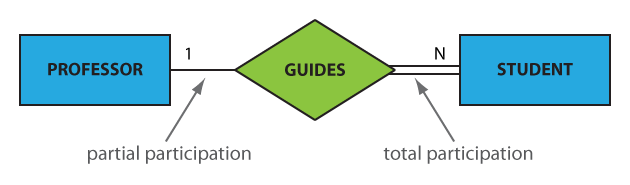 

## Key Attributes:
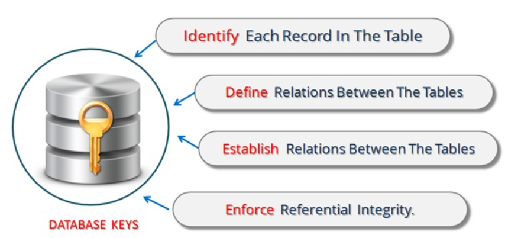 

- **Primary Key:** An attribute or a combination of attributes that uniquely identifies each instance of an entity. It is represented by underlining the attribute name.

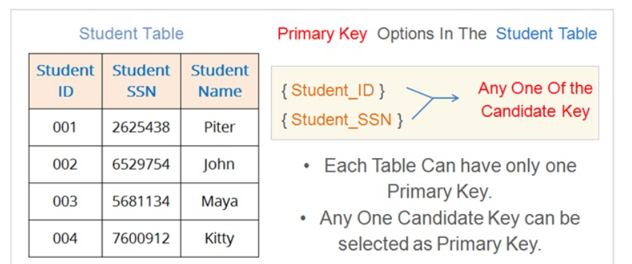 

- **Foreign Key:** An attribute in one entity that refers to the primary key of another entity, establishing a relationship between the two entities. It is represented by a dashed line connecting the foreign key attribute to the primary key of the related entity.

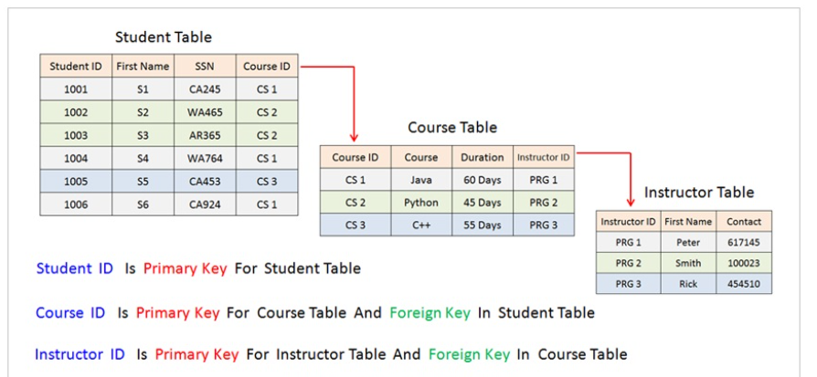 

- **Composite Key:** A primary key that consists of multiple attributes. It is represented by underlining all the attributes that make up the composite key.

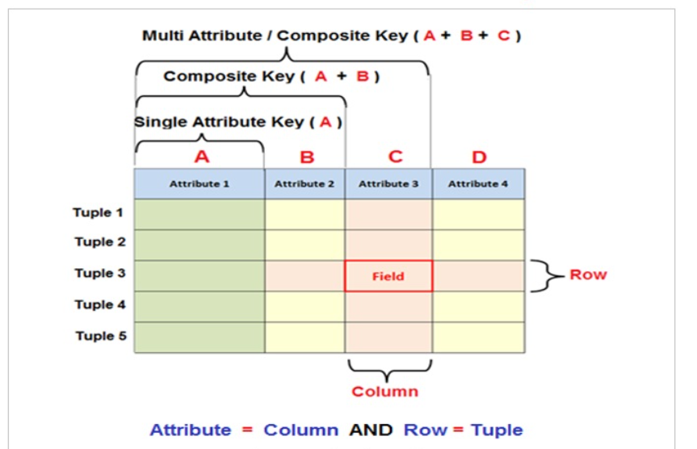 

- **Candidate Key:** An attribute or a combination of attributes that can uniquely identify an instance of an entity, but is not chosen as the primary key. It is represented by a dashed underline.

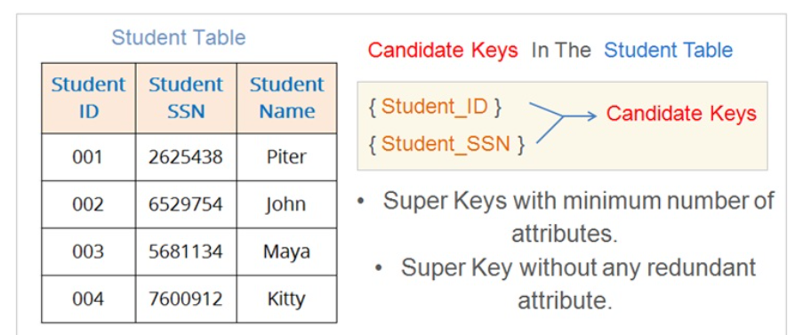 

- **Partial Key:** An attribute that can uniquely identify an instance of a weak entity, but not a strong entity. It is represented by a dashed underline with a double line.

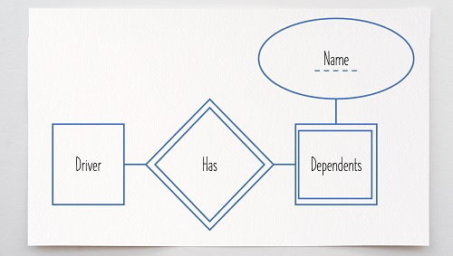 

**Additional Key Types:**

- **Alternate Key:** An attribute or a combination of attributes that can uniquely identify an instance of an entity, but is not chosen as the primary key. It is represented by a dashed underline with a single line.
- **Super Key:** A set of attributes that can uniquely identify an instance of an entity, but may include additional attributes beyond the primary key. It is represented by a dashed rectangle around the attributes.
- **Artificial Key:** A key that is created for the purpose of uniquely identifying an instance of an entity, often used when no natural key exists. It is represented by a dashed rectangle with a label indicating it is an artificial key.

