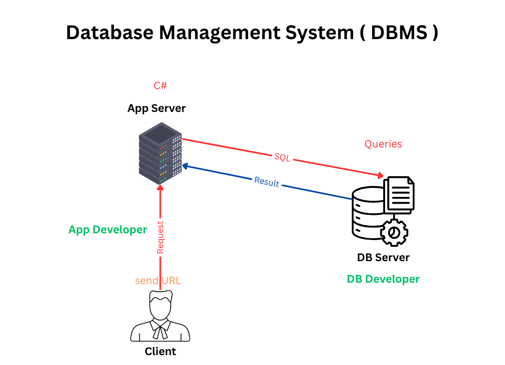

# Database

**Definition:**
A database is a structured collection of data that can be easily accessed, managed, and updated. 
It is designed to store large amounts of information in a way that allows for efficient retrieval and manipulation.
(Collection of Related Data)

**Database Management System (DBMS):**
A DBMS is software that interacts with the database, allowing users to create, read, update, and delete data.

it allow user to create, read, update, and delete data in the database.

~~Explination of DBMS:~~

This image represents the architecture of **a Database Management System (DBMS)** and how different components interact within a typical application.
At the start of the process, **the client (the user)** sends a request, typically by interacting with a user interface, such as clicking a button or submitting a form.
This request is sent through a **URL** to **the App Server**, which the **App Developer** handles. 
The **App Server** processes this request using backend logic written in **C#**, and then translates it into a **SQL query** directed to the **Database Server (DB Server)**.

The **DB Server**, managed by a **DB Developer**, receives this **query**, executes it, and returns the appropriate **results**, such as data retrieved from or updated in the database.
The **App Server** then takes this data,processes it if needed, and sends a response back to **the client**. 

In this way, the image illustrates a *three-layered structure*: the **Client (presentation layer)**, the **App Server (application layer)**, and the **DB Server (data layer)**.
Each role and technology has a specific function, working together to deliver efficient and secure data processing within the application.

**Difference between Data and metadata:**
- **Data:** The actual information stored in the database, such as customer names, addresses, and transaction records.
	- Examples include:
    - Customer names
    - Product details
    - Transaction records
    - Inventory levels

- **Metadata:** Data about the data, such as the structure of the database, data types, and relationships between tables.
	- Examples include:
	- Table names
	- Column names and data types
	- Relationships between tables
  	- Indexes and constraints

**Advantages of using a database:**
- **Data Integrity:** Ensures accuracy and consistency of data through constraints and validation rules.
- **Data Security:** Protects sensitive information through access controls and encryption.
- **Data Redundancy Reduction:** Minimizes duplicate data storage by normalizing the database structure.
- **Data Sharing:** Allows multiple users to access and manipulate data simultaneously.
- **Data Backup and Recovery:** Provides mechanisms for backing up data and restoring it in case of loss or corruption.
- **Concurrency Control:** Manages simultaneous data access by multiple users to prevent conflicts and ensure data integrity.

**Roles in a Database System:**
- **System Analyst:** Analyzes business requirements and translates them into database specifications.
- **Database Designer:** Designs the database schema, including tables, relationships, and constraints.
- **Database Developer:** Develops applications that interact with the database, including writing queries and stored procedures.
- **Database Administrator (DBA):** Responsible for managing the database, including installation, configuration, security, and performance tuning.
- **Application Developer:** Develops software applications that use the database to store and retrieve data.
- **BI Developer:** Develops business intelligence solutions, such as reports and dashboards, that utilize data from the database.

**Type of Database:**
- **Centralized Database:** A single database stored on a central server, accessible by multiple users.
- **Distributed Database:** A database that is spread across multiple locations or servers, allowing for data to be stored closer to where it is used.
- **Cloud Database:** A database that is hosted on a cloud service provider, allowing for scalability and flexibility in data storage and access.

### Database Engine:

A database engine is the underlying software that manages the storage, retrieval, and manipulation of data in a database. It provides the functionality to execute queries, manage transactions, and ensure data integrity.

