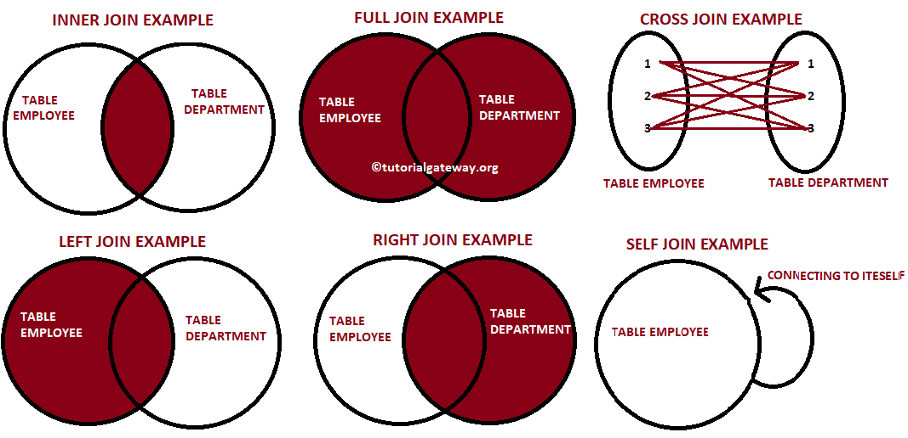

# Join in SQL

**Definition:**
A join in SQL is a clause used to combine rows from two or more tables based on a related column between them.
It allows for the retrieval of data that is spread across multiple tables, enabling complex queries and data analysis.

**Purpose:**
The purpose of a join is to retrieve related data from different tables in a relational database.
It allows users to combine information from multiple sources, making it possible to analyze and report on data that is stored in separate tables.

**Types of Joins:**
1. **Inner Join:**
   - Retrieves records that have matching values in both tables.
   - Syntax:
	 ```sql
	 SELECT columns
	 FROM table1
	 INNER JOIN table2 ON table1.column = table2.column;
	 ```

2. **Left Join (or Left Outer Join):**
   - Retrieves all records from the left table and the matched records from the right table.
   - If there is no match, NULL values are returned for columns from the right table.
   - Syntax:
	 ```sql
	 SELECT columns
	 FROM table1
	 LEFT JOIN table2 ON table1.column = table2.column;
	 ```

3. **Right Join (or Right Outer Join):**
   - Retrieves all records from the right table and the matched records from the left table.
   - If there is no match, NULL values are returned for columns from the left table.
   - Syntax:
	 ```sql
	 SELECT columns
	 FROM table1
	 RIGHT JOIN table2 ON table1.column = table2.column;
	 ```
4. **Full Join (or Full Outer Join):**
   - Retrieves all records when there is a match in either left or right table records.
   - If there is no match, NULL values are returned for columns from the table that does not have a match.
   - Syntax:
	 ```sql
	 SELECT columns
	 FROM table1
	 FULL JOIN table2 ON table1.column = table2.column;
	 ```

5. **Cross Join:**
   - Produces a Cartesian product of the two tables, returning all possible combinations of rows.
   - Syntax:
	 ```sql
	 SELECT columns
	 FROM table1
	 CROSS JOIN table2;
	 ```

6. **Self Join:**
   - A join where a table is joined with itself.
   - Useful for comparing rows within the same table.
   - Syntax:
	 ```sql
	 SELECT a.columns, b.columns
	 FROM table a, table b
	 WHERE condition;
	 ```




