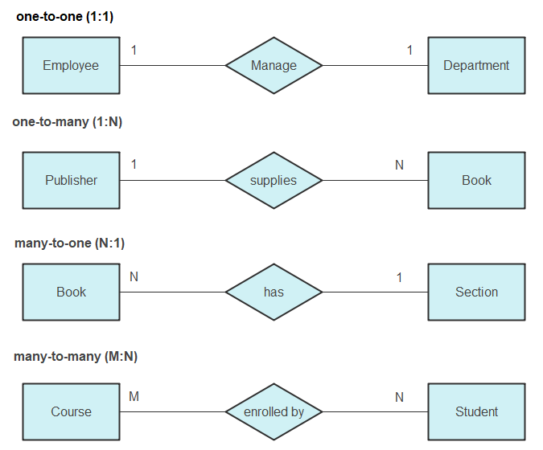

# DB LifeCycle:
1. **Analysis Phase:** 
   - Input: Business requirements and user needs.
   - Output: Requirements specification document.
2. **Design Phase:**
   - Input: Requirements specification document.
   - Output: Database schema design, including entity-relationship diagrams (ERD).
3. **Mapping Phase:**
   - Input: ERD and database schema design.
   - Output: Relational schema, including tables, columns, and relationships.
4. **Implementation Phase:**
   - Input: Relational schema.
   - Output: Physical database implementation, including creation of tables and relationships in a DBMS.
5. **Application GUI Phase:**
   - Input: Physical database implementation.
   - Output: User interface for interacting with the database, including forms and reports.
6. **Clint Phase:**
   - Input: User interface.
   - Output: Client application that allows users to interact with the database, including data entry and retrieval.

## Mapping in Database

Before we start mapping, we need to understand the following concepts:
- Symbols used in ERD:

- Relationships in ERD:

## Definition:
Mapping in a database refers to the process of defining how data from one structure (like an entity-relationship model) corresponds to another structure (like a relational database schema). It involves translating entities, attributes, and relationships into tables, columns, and foreign keys.

## Purpose:

The purpose of mapping is to ensure that the data model accurately reflects the business requirements and that the database can efficiently store and retrieve data. It helps in maintaining data integrity, consistency, and relationships between different data entities.

## Converte ERD to Relational Mapping:
**Step 1: Mapping of Regular Entitie Types**
**Step 2: Mapping of Weak Entity Types**
**Step 3: Mapping of 1:1 Entity Types**
**Step 4: Mapping of 1:N Entity Types**
**Step 5: Mapping of M:N Entity Types**
**Step 6: Mapping of N-ary Entity Types**
**Step 7: Mapping of Unary Entity Types**

## Step 1: Mapping of Regular Entity Types
1. **Create a table for each regular entity type.**
1. **Use the entity name as the table name.**
1. **Use the attributes of the entity as columns in the table.**
1. **Choose a primary key for the table, which can be a single attribute or a combination of attributes.**
1. **Include any necessary constraints, such as NOT NULL or UNIQUE, on the columns.**
1. **If the entity has a composite key, include all attributes that make up the composite key in the table.**
1. **If the entity has a foreign key relationship with another entity, include the foreign key column in the table.**
1. **If the entity has a weak entity relationship, include the primary key of the owner entity as a foreign key in the table.**
1. **If the entity has a multi-valued attribute, create a separate table for the multi-valued attribute and establish a foreign key relationship with the main entity table.**
1. **If the entity has a derived attribute, do not include it in the table, as it can be calculated from other attributes.**
1. **If the entity has a relationship with another entity, create a separate table for the relationship and include foreign keys to both entities.**

## Step 2: Mapping of Weak Entity Types
1. **Create a table for the weak entity type.**
1. **Use the weak entity name as the table name.**
1. **Use the attributes of the weak entity as columns in the table.**
1. **Include the primary key of the owner entity as a foreign key in the table.**
1. **Choose a primary key for the weak entity table, which can be a combination of the foreign key from the owner entity and the weak entity's own attributes.**

## Step 3: Mapping of 1:1 Entity Types
1. While the relationship is 1:1 I will take the key of any table and put it in the other
one.but to make sure take the PK of the table have the most attributes and put it in the other table as a FK.

## Step 4: Mapping of 1:N Entity Types

1. Take th PK of entity on the 1 side and put it in the entity on the N side as a FK.

## Step 5: Mapping of M:N Entity Types

1. Create a new table to represent the M:N relationship.

## Step 6: Mapping of N-ary Entity Types
1. Create a new table to represent the N-ary relationship.
1. Include foreign keys for all participating entities in the N-ary relationship.
1. Choose a primary key for the N-ary relationship table, which can be a combination of the foreign keys from the participating entities.

## Step 7: Mapping of Unary Entity Types
1. return back to the first step and treat the unary entity as a regular entity.

## Example of Mapping Process
1. **Identify Entities and Attributes:**
   - Entities: Customer, Order
   - Attributes: Customer (CustomerID, Name, Email), Order (OrderID, OrderDate, CustomerID)

2. **Create Tables:**
1. **Customer Table:**
   - Columns: CustomerID (PK), Name, Email
2. **Order Table:**
   - Columns: OrderID (PK), OrderDate, CustomerID (FK referencing Customer)

3. **Define Relationships:**
1. **Customer to Order Relationship:**
   - One-to-Many (1:N) relationship
   - CustomerID in Order table is a foreign key referencing Customer table
4. **Constraints:**
   - Ensure CustomerID in Order table is not null (to maintain referential integrity)
   - Ensure CustomerID in Customer table is unique (to maintain primary key constraint)

